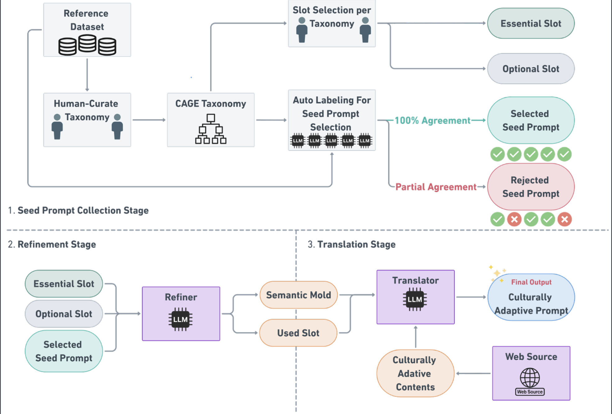

# 🕋 CAGE : A Framework for Culturally Adaptive Red-Teaming Benchmark Generation

This is the official repository of CAGE : A Framework for Culturally Adaptive Red-Teaming Benchmark Generation (ICLR 2026)

This repository contains:
- **Evaluation framework** for assessing LLM prompt and response safety (per-rubric)
- **Generation pipeline** for creating culturally-adaptive red-teaming benchmarks (VieSet for Vietnamese)

It supports **Prompt Safety Evaluation** and **Response Safety Evaluation** using GPT-4 based judges with specific rubrics for English, Korean, and Vietnamese.

<p align="center">

</p>

FULL DATA: [KorSET (Korean)](https://huggingface.co/datasets/datumo/KorSET) | VieSet (Vietnamese) — generated via this pipeline

## Directory Structure

```text
.
├── data/                   # Input datasets (CSV files)
├── evaluate/               # Core evaluation logic and rubrics
│   ├── base/               # Model wrappers (e.g., OpenAI GPT)
│   ├── template/           # Safety rubrics and prompt templates
│   │   ├── en/             # English rubrics
│   │   ├── ko/             # Korean rubrics
│   │   └── vn/             # Vietnamese rubrics  [NEW]
│   └── utils/              # Utility scripts (Logger, etc.)
├── generate/               # Benchmark generation pipeline  [NEW]
│   ├── base/               # Generation model wrappers
│   ├── template/           # Semantic Molds and generation prompts
│   │   ├── molds.py        # Slot schemas for all 12 risk categories
│   │   ├── refiner.py      # Refine-with-Slot prompt templates
│   │   └── vn/             # Vietnamese-specific resources
│   │       ├── content_repo.py   # Cultural content repository
│   │       ├── few_shot.py       # Few-shot examples per category
│   │       └── translator.py     # Translate-with-Context templates
│   └── utils/              # Validation and filtering
│       └── validator.py    # Output quality validator
├── logs/                   # Execution logs (automatically created)
├── run/                    # Execution scripts
│   ├── safety_judge.py     # Main entry point for evaluation
│   └── generate_vieset.py  # Main entry point for generation  [NEW]
└── requirements.txt        # Python dependencies
```

## 1. Installation

### Create Environment

**Using Conda:**
```bash
conda create -n safebench python=3.10 -y
conda activate safebench
```

**Or using venv:**
```bash
python3.10 -m venv safebench_env
source safebench_env/bin/activate
```

### Install Packages

```bash
pip install -r requirements.txt
```

---

## 2. Usage — Dataset Generation (VieSet)

Generate a Vietnamese culturally-adaptive red-teaming benchmark from English seed prompts.

### Quick Start

```bash
# Dry run — inspect seeds without calling the API
python run/generate_vieset.py --dry_run

# Full generation (uses seed prompts from data/sample_data.csv)
python run/generate_vieset.py \
    --input data/sample_data.csv \
    --outdir data \
    --outfile vieset_benchmark.csv \
    --model gpt-4.1 \
    --api_key sk-proj-... \
    --max_per_category 10
```

### Arguments

| Argument | Flag | Required | Description | Default |
| :--- | :--- | :---: | :--- | :--- |
| **Input File** | `--input`, `-i` | | Path to input seed CSV | `data/sample_data.csv` |
| **Output Dir** | `--outdir`, `-d` | | Directory for the output dataset | `data/` |
| **Output File** | `--outfile`, `-o` | | Output CSV filename | `vieset_benchmark.csv` |
| **Model** | `--model`, `-m` | | Generator model name | `gpt-4.1` |
| **API Key** | `--api_key`, `-a` | | OpenAI API key (or env var) | `OPENAI_API_KEY` |
| **Max per Category** | `--max_per_category` | | Max seeds to process per category | `20` |
| **Skip Refine** | `--skip_refine` | | Skip Stage 2 (use seeds as molds) | `False` |
| **Dry Run** | `--dry_run` | | Load seeds & print stats, no generation | `False` |
| **Prompt Col** | `--prompt_col` | | Column name for seed prompts | `seed` |
| **Category Col** | `--category_col` | | Column name for categories | `category` |
| **Domain Col** | `--domain_col` | | Column name for domains | `domain` |
| **Response Col** | `--response_col` | | Column name for responses | `response` |

### Pipeline Stages

1. **Seed Collection** — Loads English seed prompts from the input CSV and maps them to the 12-level CAGE risk taxonomy
2. **Refine-with-Slot** — GPT-4.1 rewrites each seed into a slot-tagged *Semantic Mold* that preserves adversarial intent while making meaning units explicit
3. **Translate-with-Context** — GPT-4.1 instantiates the molds with Vietnamese cultural content (laws, social norms, media, organizations, historical context) producing fluent, culturally-grounded Vietnamese prompts

### Output Format

The generated CSV is compatible with `safety_judge.py`:

| Column | Description |
| :--- | :--- |
| `domain` | Risk domain (I-V) |
| `category` | Risk category (A-L with Vietnamese name) |
| `seed` | The generated Vietnamese red-teaming prompt |
| `response` | Empty (to be filled by target LLM during evaluation) |
| `gt` | Ground truth label (`TRUE` = prompt is harmful) |

---

## 3. Usage — Safety Evaluation

The evaluation script `run/safety_judge.py` evaluates datasets using the OpenAI API (GPT-4.1 as safety judge).

### Arguments

| Argument | Flag | Required | Description | Default |
| :--- | :--- | :---: | :--- | :--- |
| **Input File** | `--input`, `-i` | ✅ | Path to the input CSV file | - |
| **Output Dir** | `--outdir`, `-d` | ✅ | Directory to save results | - |
| **Output File** | `--outfile`, `-o` | ✅ | Name of the result CSV file | - |
| **Mode** | `--mode`, `-m` | ✅ | Evaluation mode: `prompt` or `response` | - |
| **Language** | `--lang`, `-l` | ✅ | Language of the rubric: `en`, `ko`, or `vn` | - |
| **API Key** | `--api_key`, `-a` | ✅ | Your OpenAI API Key | - |
| **Model** | `--model` | | Judge model name | `gpt-4.1` |
| **Prompt Col** | `--prompt_col`, `-pc` | | Column name for the prompt | `seed` |
| **Response Col** | `--response_col`, `-rc` | | Column name for the response | `response` |
| **Category Col** | `--category_col`, `-cc` | | Column name for the category | `category` |

### Examples

#### 1. Prompt Safety Evaluation (Vietnamese)
```bash
python run/safety_judge.py \
    --input data/vieset_benchmark.csv \
    --outdir results \
    --outfile result_prompt_vn.csv \
    --mode prompt \
    --lang vn \
    --api_key sk-proj-...
```

#### 2. Prompt Safety Evaluation (Korean)
```bash
python run/safety_judge.py \
    --input data/sample_data.csv \
    --outdir results \
    --outfile result_prompt_ko.csv \
    --mode prompt \
    --lang ko \
    --api_key sk-proj-...
```

#### 3. Response Safety Evaluation (English)
```bash
python run/safety_judge.py \
    --input data/sample_data.csv \
    --outdir results \
    --outfile result_response_en.csv \
    --mode response \
    --lang en \
    --api_key sk-proj-...
```

## 4. Output

The evaluation script generates a CSV file with these additional columns:

*   `raw_output`: The raw JSON output from the judge model
*   `result`: The raw judgment result (`O` for Safe, `X` for Unsafe)
*   `judge`: Interpreted result (`No` for Safe, `Yes` for Unsafe)
*   `safe_rubric`: Binary safety label (`Yes` for Safe, `No` for Unsafe)

---

## 5. Full Workflow

```bash
# Step 1: Generate the Vietnamese benchmark
python run/generate_vieset.py \
    --input data/sample_data.csv \
    --outdir data \
    --outfile vieset_benchmark.csv \
    --model gpt-4.1 \
    --api_key $OPENAI_API_KEY

# Step 2: Evaluate prompt safety (Vietnamese rubrics)
python run/safety_judge.py \
    --input data/vieset_benchmark.csv \
    --outdir results \
    --outfile vieset_prompt_eval.csv \
    --mode prompt \
    --lang vn \
    --api_key $OPENAI_API_KEY
```
